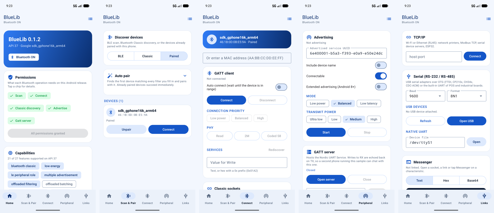
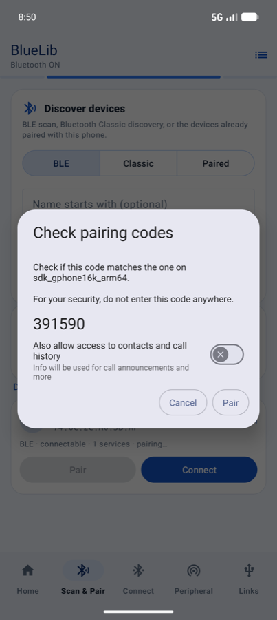
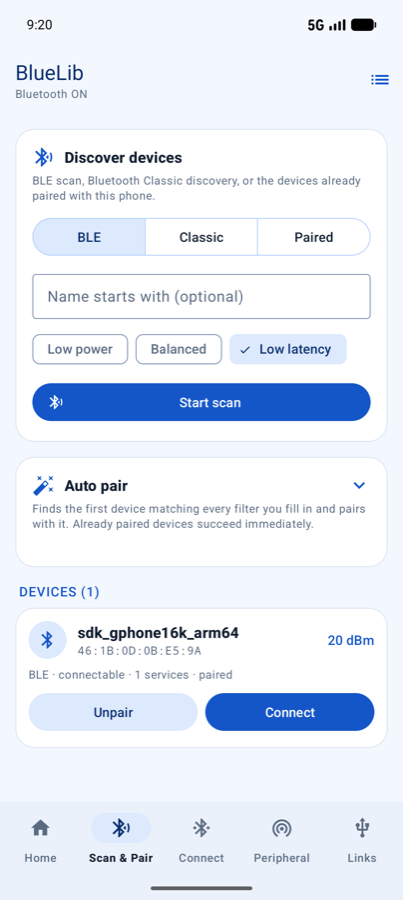
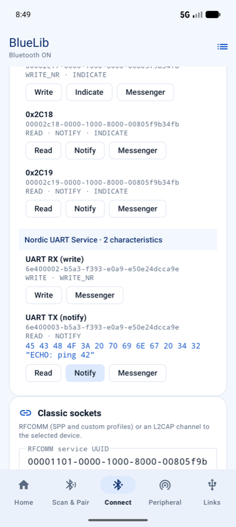
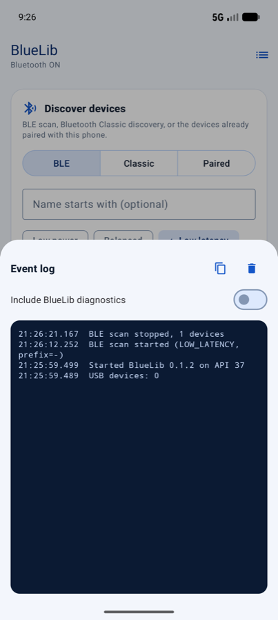

# BlueLib

[](https://github.com/cybersafetyid/BlueLib/actions/workflows/ci.yml)
[](https://github.com/cybersafetyid/BlueLib/actions/workflows/docs.yml)
[](https://github.com/cybersafetyid/BlueLib/actions/workflows/release.yml)
[](https://central.sonatype.com/artifact/io.github.cybersafetyid/bluelib)
[](https://cybersafetyid.github.io/BlueLib/)
[](https://cybersafetyid.github.io/BlueLib/compatibility-matrix/)
[](LICENSE)

BlueLib is a coroutine-first Android device communication library supporting Android 5.0 (API 21) through Android 17 (API 37). It wraps the complete Android Bluetooth API surface—BLE scanning, advertising, GATT client, GATT server, bonding, RFCOMM, and L2CAP—behind a clean, type-safe reactive API with structured error handling and no hidden APIs. The same messaging API also runs over **TCP/IP**, **USB serial** (FTDI, CP210x, CH34x, CDC-ACM) and **native UART** (RS-232/RS-485) links.

---

## Table of Contents

- [Key Features](#key-features)
- [Screenshots](#screenshots)
- [Platform Comparison](#platform-comparison)
- [Requirements](#requirements)
- [Installation](#installation)
- [Quick Start](#quick-start)
- [Module Architecture](#module-architecture)
- [Documentation Guides](#documentation-guides)
- [Contributing](#contributing)
- [Building and Testing](#building-and-testing)
- [License](#license)

---

## Key Features

- **Coroutine-First & Reactive**: Native Kotlin Coroutines and `Flow` support for asynchronous operations and event streaming.
- **Structured Error Taxonomy**: Wraps Android platform status codes into typed `BlueLibError` instances with recovery hints (`isRetryable`) and documentation anchors.
- **Platform Protection**: Built-in `ScanQuotaGovernor` prevents system scan throttling and leak-resistant session lifecycle management.
- **Pure Kotlin Domain**: Core business logic and state machines reside in `bluelib-core` without Android framework dependencies.
- **Complete Feature Set**: Supports BLE scanning, advertising, GATT client/server, bonding, dynamic auto-pairing, RFCOMM sockets, and L2CAP channels.
- **Multi-Format Data Messaging**: `BluetoothMessenger` with `DataCodec` and `MessageFramer` for robust bi-directional communication (Text UTF-8/ASCII, Hex, Binary, Base64, and Raw bytes).
- **Beyond Bluetooth**: `connectTcp`, `connectUsbSerial` and `openUart` return the same `ByteConnection`, so one `createMessenger` call covers Bluetooth Classic, Wi-Fi/Ethernet, USB to RS-232/RS-485 cables and built-in serial ports.
- **Dynamic Auto Pairing**: Automated discovery and bonding using `AutoPairFilter` (MAC, name, name prefix, service UUIDs, manufacturer ID, and RSSI proximity).
- **Test Infrastructure**: `bluelib-testing` module provides fakes for hardware-free unit and integration testing.

---

## Screenshots

The [`sample`](sample) app exercises every feature of the library. These screenshots were captured on two
Android 17 (API 37) emulators talking to each other over a virtual Bluetooth radio: one acts as the
central, the other as the peripheral running the sample's GATT server.

<p align="center">
  
</p>

| Pairing | Paired | GATT notify round trip | Event log |
| :---: | :---: | :---: | :---: |
|  |  |  |  |
| `blueLib.bond()` starts LE Secure Connections pairing | Bond confirmed through `BOND_STATE_CHANGED` | `session.write()` to RX, echo received through `session.subscribe()` on TX | Every operation and `DiagnosticEvent` in one stream |

| Tab | What it demonstrates |
| --- | --- |
| **Home** | Adapter state, runtime permissions per operation, capability report with reasons, data codecs and framers |
| **Scan & Pair** | BLE scan, Classic discovery, paired devices, manual pair/unpair, auto pair with every `AutoPairFilter` field |
| **Connect** | GATT client (services, read/write/notify, MTU, connection priority, PHY, GATT messenger), RFCOMM and L2CAP sockets |
| **Peripheral** | LE advertising and a GATT server exposing the Nordic UART Service with an echo |
| **Links** | TCP/IP, USB serial (FTDI, CP210x, CH34x, CDC-ACM) and native UART, all through the same messenger |

---

## Platform Comparison

| Platform Problem | BlueLib Solution |
| --- | --- |
| Callback status codes (e.g. status 133) | Wrapped into typed `BlueLibError` with recovery guidance |
| Scan quota throttling (5 starts per 30s) | Pre-execution throttling check via `ScanQuotaGovernor` |
| Advertising payload truncation | Payload budget validation prior to platform execution |
| Lost notifications on reconnect | Automatic CCCD descriptor re-subscription |
| Permission matrix complexity (API 21 to 37) | Permission gateway distinguishing user denial from manifest declarations |
| Minor SDK API changes (e.g. API 36.1) | `ApiLevel` checks supporting minor release detection |
| GATT server hangs | Local model response handling by default with manual fallback |

---

## Requirements

| Requirement | Specification |
| --- | --- |
| Minimum SDK | API 21 (Android 5.0 Lollipop) |
| Target & Compile SDK | API 37 (Android 17) |
| Build Toolchain | AGP 9.1.1+, JDK 17 |
| Language Target | Kotlin 2.2.0+, JVM 17 Bytecode |

---

## Installation

Current Release Version: `0.2.0`

### Kotlin DSL (`build.gradle.kts`)

```kotlin
dependencies {
    implementation("io.github.cybersafetyid:bluelib:0.2.0")
    testImplementation("io.github.cybersafetyid:bluelib-testing:0.2.0")
}
```

### Groovy DSL (`build.gradle`)

```groovy
dependencies {
    implementation 'io.github.cybersafetyid:bluelib:0.2.0'
    testImplementation 'io.github.cybersafetyid:bluelib-testing:0.2.0'
}
```

### Version Catalog (`gradle/libs.versions.toml`)

```toml
[versions]
bluelib = "0.2.0"

[libraries]
bluelib = { module = "io.github.cybersafetyid:bluelib", version.ref = "bluelib" }
bluelib-testing = { module = "io.github.cybersafetyid:bluelib-testing", version.ref = "bluelib" }
```

---

## Quick Start

### Initialize Facade

```kotlin
val blueLib = BlueLib.create(context)
```

### BLE Scanning

```kotlin
blueLib.scan(ScanRequest(timeoutMillis = 10_000))
    .filterIsInstance<ScanEvent.Observed>()
    .collect { event ->
        println("Device: ${event.observation.deviceId}, RSSI: ${event.observation.rssi}")
    }
```

### Dynamic Auto Pairing

```kotlin
val filter = AutoPairFilter(
    deviceName = "SmartScale-Pro",
    minRssi = -65, // Proximity filtering
    serviceUuids = listOf(BluetoothUuid.parse("0000181d-0000-1000-8000-00805f9b34fb")),
)

blueLib.autoPair(filter).onSuccess { deviceId ->
    println("Auto-paired with device: $deviceId")
}
```

### GATT Connection & Operations

```kotlin
val session = blueLib.connect(deviceId).getOrThrow()

// Create a high-level Data Messenger with Line-Feed ('\n') framing
val messenger = blueLib.createGattMessenger(
    session = session,
    serviceUuid = serviceUuid,
    characteristicUuid = characteristicUuid,
    framer = DelimiterFramer.lineFeed(),
)

// Send data in various encodings
messenger.sendText("Hello World!")
messenger.sendHex("0A1B2C3D")
messenger.sendBinary("01001000 01100101")
messenger.sendBase64("SGVsbG8gQmx1ZXRvb3RoIQ==")

// Collect incoming messages reactively as decoded text
messenger.incomingText().collect { text ->
    println("Received message: $text")
}
```

### TCP/IP, USB Serial and UART

```kotlin
// Network printer or serial device server over Wi-Fi/Ethernet
val tcp = blueLib.connectTcp("192.168.1.50", 9100).getOrThrow()

// USB to RS-232 cable (FTDI, CP210x, CH34x, CDC-ACM)
val usb = blueLib.connectUsbSerial(
    device = blueLib.usbDevices().first { it.driver != null },
    settings = SerialSettings(baudRate = 9600),
).getOrThrow()

// Built-in RS-232 port of a POS/industrial board
val uart = blueLib.openUart("/dev/ttyS3", SerialSettings(baudRate = 115_200)).getOrThrow()

// Same messaging API on every link
val messenger = blueLib.createMessenger(usb, framer = DelimiterFramer(byteArrayOf(0x0D, 0x0A)))
messenger.sendText("READ")
```

---

## Module Architecture

BlueLib is split across four modules following clean architecture boundaries:

| Module Artifact | Description |
| --- | --- |
| `io.github.cybersafetyid:bluelib` | Public facade unifying library capabilities |
| `io.github.cybersafetyid:bluelib-android` | Android platform adapters (Permissions, Scanner, Advertiser, GATT, Classic, USB) |
| `io.github.cybersafetyid:bluelib-core` | Pure Kotlin domain layer (Models, Validation, State Machines, Error Taxonomy, TCP/UART transports, USB serial protocols) |
| `io.github.cybersafetyid:bluelib-testing` | Test fakes for hardware-free unit testing |

---

## Documentation Guides

Full documentation is published at [cybersafetyid.github.io/BlueLib](https://cybersafetyid.github.io/BlueLib/).

| Guide | Description |
| --- | --- |
| [Getting Started](docs/getting-started.md) | Setup, permissions, lifecycle, and initial operations |
| [Architecture](docs/architecture.md) | Clean architecture breakdown, module rules, ports and adapters |
| [Permissions & Pairing](docs/guides/permissions-and-pairing.md) | Permission requirements across API 21-37 and bonding workflows |
| [BLE Scanning](docs/guides/scanning.md) | Filters, background scanning, and quota management |
| [BLE Advertising](docs/guides/advertising.md) | Legacy vs extended sets, payload constraints, and positioning |
| [GATT Client](docs/guides/gatt-client.md) | Connection lifecycle, MTU, PHY, reads, writes, and notifications |
| [GATT Server](docs/guides/gatt-server.md) | Service setup, auto-responses, and subscription tracking |
| [Bluetooth Classic](docs/guides/classic.md) | Device discovery, RFCOMM sockets, and L2CAP channels |
| [TCP/IP, USB and Serial](docs/guides/wired-and-network.md) | TCP client, USB serial adapters, native UART, RJ45 serial |
| [Testing Strategy](docs/guides/testing.md) | Unit testing using `bluelib-testing` and Robolectric |
| [Compatibility Matrix](docs/compatibility-matrix.md) | Complete SDK API compatibility mapping |
| [Troubleshooting](docs/troubleshooting.md) | Diagnostic rules and resolution steps for error codes |
| [Research Notes](docs/research/android-17-bluetooth.md) | Deep dive into Android 5 through 17 Bluetooth platform changes |
| [Device Communication](docs/research/device-communication.md) | Every device-to-device link on Android and BlueLib status |

---

## Contributing

Contributions are welcome. Please read [docs/contributing.md](docs/contributing.md) for full development guidelines.

### Core Development Principles

1. **Domain Isolation**: `bluelib-core` must never import `android.*` or `androidx.*` dependencies.
2. **Safe API Guarding**: SDK checks must use `ApiLevel` utilities rather than raw `Build.VERSION.SDK_INT` comparisons.
3. **Result Types**: Return `BlueLibResult.Failure` with a `BlueLibError` instance rather than throwing exceptions.
4. **Test Coverage**: Every logic modification requires automated unit or integration tests.
5. **Commit Message Standard**: Use `<scope>: <imperative summary>` format (e.g., `core: validate advertising payload length`).

---

## Building and Testing

Verify changes locally using Gradle:

```bash
# Execute unit tests, linter, and domain isolation checks
./gradlew check

# Regenerate compatibility matrix documentation
./gradlew generateCompatibilityMatrix

# Build Maven Central staging publication bundle
./gradlew publishAllPublicationsToStagingRepository

# Preview documentation locally (requires MkDocs)
mkdocs serve
```

---

## License

BlueLib is licensed under the [Apache License 2.0](LICENSE).

BlueLib is an independent open-source project maintained by [cybersafetyid](https://github.com/cybersafetyid) and is not affiliated with Google, Bluetooth SIG, or any device manufacturer.
